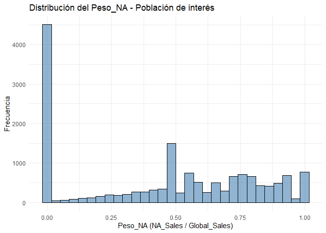
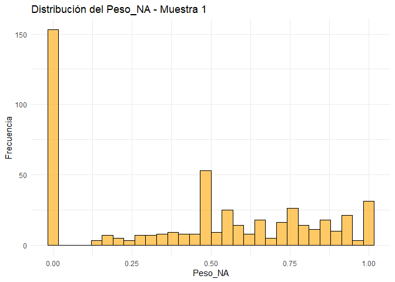
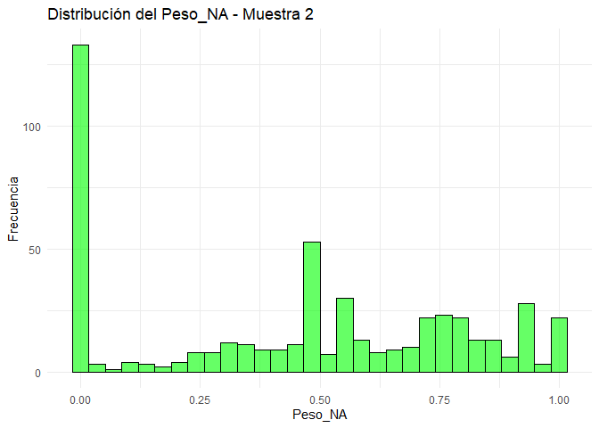

01_Tarea - Análisis de Ventas de Videojuegos
================
Khalil Arab
2025-10-15

``` r
# ================================
# 1. Cargar librerías y datos
# ================================

library(dplyr)
```

    ## 
    ## Adjuntando el paquete: 'dplyr'

    ## The following objects are masked from 'package:stats':
    ## 
    ##     filter, lag

    ## The following objects are masked from 'package:base':
    ## 
    ##     intersect, setdiff, setequal, union

``` r
library(ggplot2)

data_path <- file.path("C:/Users/khali/OneDrive/Desktop/Universidad/Estadistica")
data_file <- file.path(data_path, "vgsales.csv")

data.vg <- read.csv(data_file, header = TRUE)

if (!exists("data.vg") || nrow(data.vg) == 0) {
  stop("❌ No se pudo cargar el archivo vgsales.csv. Verifica la ruta del archivo.")
}

head(data.vg)
```

    ##   Rank                     Name Platform Year        Genre Publisher NA_Sales
    ## 1    1               Wii Sports      Wii 2006       Sports  Nintendo    41.49
    ## 2    2        Super Mario Bros.      NES 1985     Platform  Nintendo    29.08
    ## 3    3           Mario Kart Wii      Wii 2008       Racing  Nintendo    15.85
    ## 4    4        Wii Sports Resort      Wii 2009       Sports  Nintendo    15.75
    ## 5    5 Pokemon Red/Pokemon Blue       GB 1996 Role-Playing  Nintendo    11.27
    ## 6    6                   Tetris       GB 1989       Puzzle  Nintendo    23.20
    ##   EU_Sales JP_Sales Other_Sales Global_Sales
    ## 1    29.02     3.77        8.46        82.74
    ## 2     3.58     6.81        0.77        40.24
    ## 3    12.88     3.79        3.31        35.82
    ## 4    11.01     3.28        2.96        33.00
    ## 5     8.89    10.22        1.00        31.37
    ## 6     2.26     4.22        0.58        30.26

``` r
# ================================
# 2. Crear la población de interés
# ================================

# Población: videojuegos con ventas globales menores a 2 millones
poblacion <- dplyr::filter(data.vg, Global_Sales < 2)

# Verificar el tamaño de la población
nrow(poblacion)
```

    ## [1] 15747

``` r
# ================================
# 3. Crear la variable Peso_NA
# ================================

# Peso_NA = proporción de ventas en Norteamérica sobre ventas globales
poblacion <- poblacion %>%
  mutate(Peso_NA = ifelse(Global_Sales > 0, NA_Sales / Global_Sales, 0))

# Visualizar las primeras filas para confirmar
head(poblacion[, c("Name", "NA_Sales", "Global_Sales", "Peso_NA")])
```

    ##                                      Name NA_Sales Global_Sales   Peso_NA
    ## 1               Tenchu: Stealth Assassins     0.95         1.99 0.4773869
    ## 2                                  Tennis     0.75         1.99 0.3768844
    ## 3 Harry Potter and the Chamber of Secrets     1.21         1.99 0.6080402
    ## 4 Harry Potter and the Chamber of Secrets     0.75         1.98 0.3787879
    ## 5                                 SimCity     0.93         1.98 0.4696970
    ## 6                           Battlefield 4     1.25         1.98 0.6313131

``` r
# ================================
# 4. Crear dos muestras aleatorias de tamaño 500
# ================================

set.seed(123)  # para asegurar reproducibilidad
muestra1 <- sample_n(poblacion, 500)
muestra2 <- sample_n(poblacion, 500)

# Mostrar tamaño de las muestras
nrow(muestra1)
```

    ## [1] 500

``` r
nrow(muestra2)
```

    ## [1] 500

``` r
# ================================
# 5. Estadísticas descriptivas
# ================================

# Función para calcular medidas básicas
estadisticas <- function(df) {
  data.frame(
    Media = mean(df$Peso_NA, na.rm = TRUE),
    Mediana = median(df$Peso_NA, na.rm = TRUE),
    Desviacion = sd(df$Peso_NA, na.rm = TRUE),
    Minimo = min(df$Peso_NA, na.rm = TRUE),
    Maximo = max(df$Peso_NA, na.rm = TRUE)
  )
}

# Estadísticas comparativas
cat("📌 Estadísticas de la población:\n")
```

    ## 📌 Estadísticas de la población:

``` r
print(estadisticas(poblacion))
```

    ##       Media Mediana Desviacion Minimo Maximo
    ## 1 0.4537024     0.5  0.3466132      0      1

``` r
cat("\n📌 Estadísticas de la muestra 1:\n")
```

    ## 
    ## 📌 Estadísticas de la muestra 1:

``` r
print(estadisticas(muestra1))
```

    ##       Media Mediana Desviacion Minimo Maximo
    ## 1 0.4462067     0.5  0.3517133      0      1

``` r
cat("\n📌 Estadísticas de la muestra 2:\n")
```

    ## 
    ## 📌 Estadísticas de la muestra 2:

``` r
print(estadisticas(muestra2))
```

    ##       Media Mediana Desviacion Minimo Maximo
    ## 1 0.4526871     0.5  0.3381385      0      1

``` r
# ================================
# 6. Gráficos de distribución
# ================================

# Histograma de la población
ggplot(poblacion, aes(x = Peso_NA)) +
  geom_histogram(bins = 30, fill = "steelblue", color = "black", alpha = 0.6) +
  labs(title = "Distribución del Peso_NA - Población de interés",
       x = "Peso_NA (NA_Sales / Global_Sales)",
       y = "Frecuencia") +
  theme_minimal()
```

<!-- -->

``` r
# Histograma muestra 1
ggplot(muestra1, aes(x = Peso_NA)) +
  geom_histogram(bins = 30, fill = "orange", color = "black", alpha = 0.6) +
  labs(title = "Distribución del Peso_NA - Muestra 1",
       x = "Peso_NA",
       y = "Frecuencia") +
  theme_minimal()
```

<!-- -->

``` r
# Histograma muestra 2
ggplot(muestra2, aes(x = Peso_NA)) +
  geom_histogram(bins = 30, fill = "green", color = "black", alpha = 0.6) +
  labs(title = "Distribución del Peso_NA - Muestra 2",
       x = "Peso_NA",
       y = "Frecuencia") +
  theme_minimal()
```

<!-- -->

``` r
# ================================
# 7. Conclusiones y observaciones
# ================================

cat("
Conclusiones:
--------------
- Las dos muestras aleatorias de 500 observaciones mantienen tendencias similares a la población.
- Se observa que las ventas en Norteamérica suelen representar una proporción considerable de las ventas globales.
- Las medias y medianas de las muestras son cercanas a las de la población, lo que indica representatividad.
- Las pequeñas diferencias entre las muestras reflejan variabilidad muestral esperada.
")
```

    ## 
    ## Conclusiones:
    ## --------------
    ## - Las dos muestras aleatorias de 500 observaciones mantienen tendencias similares a la población.
    ## - Se observa que las ventas en Norteamérica suelen representar una proporción considerable de las ventas globales.
    ## - Las medias y medianas de las muestras son cercanas a las de la población, lo que indica representatividad.
    ## - Las pequeñas diferencias entre las muestras reflejan variabilidad muestral esperada.
